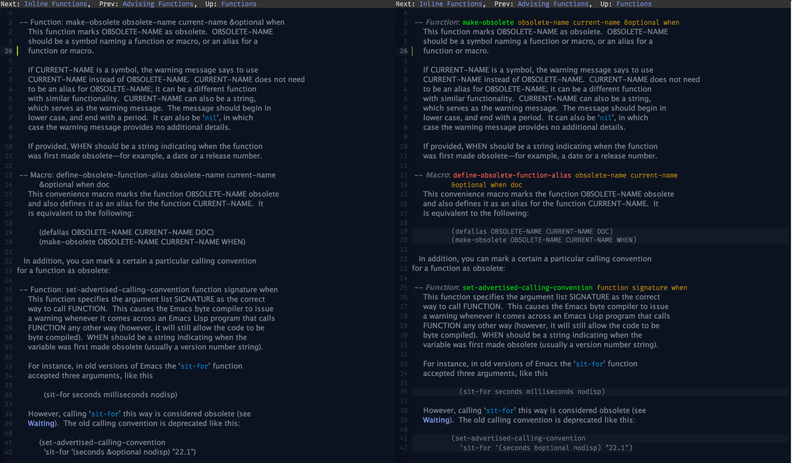

# Extra colors for Emacs's Info-mode

This is a modern adaption of the extra coloring provided by Drew Adams' `info+` package.

# Usage

Install and enable this with

```emacs-lisp
(add-hook 'Info-selection-hook 'info-colors-fontify-node)
```


